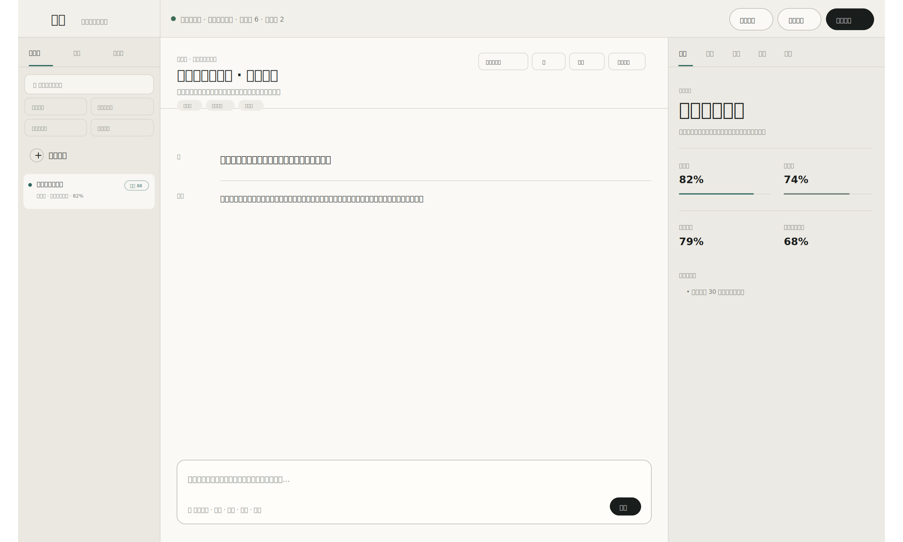
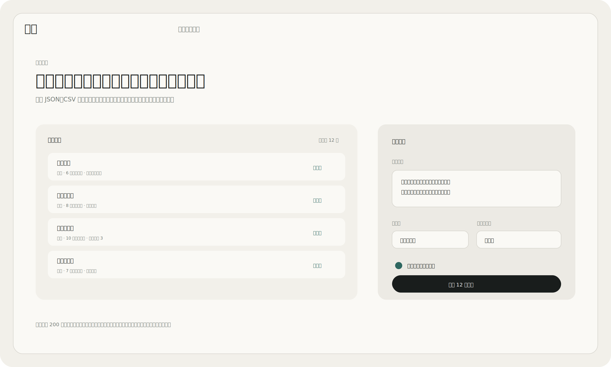
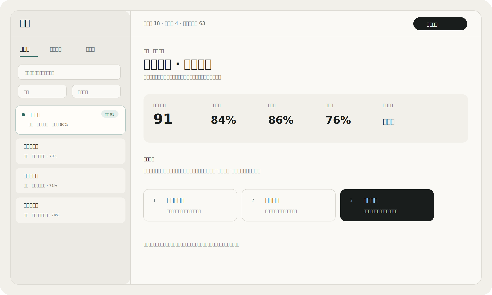
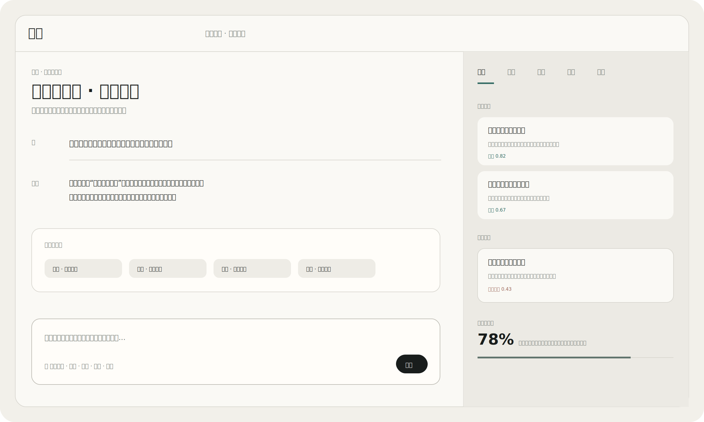

# 观潮 · Guanchao

**面向社交平台账号与内容的多模态调查 Agent Harness**

账号调查 · 批量调查 · 证据核查 · 风险研判 · 人工复核 · 持续观察 · Harness 自进化

> 把账号主页、近期内容、图片、视频、音频和文档放进同一调查上下文，用证据形成可复核判断。  
> **产品边界：** 商业内容不等于违规。观潮辅助调查、研判、证据整理和人工复核，不自动处罚、举报、封禁或做事实定性。



---

## 为什么是 Harness，而不是一个固定分类器

观潮不是“给账号打一个营销分”的单点模型。它需要同时决定：当前证据是否可靠、下一项核查最值得做什么、什么时候应该主动寻找反向证据、什么时候继续调查已经没有边际价值，以及人工复核回来以后，下一次调查是否应该改变自己的策略。

因此，观潮把系统拆成三个彼此约束的层次：

| 层次 | 职责 | 是否允许自进化 |
| --- | --- | --- |
| **证据感知** | 从主页、内容与多模态素材提取可观察事实 | 传感器可改进，但不能越权裁决 |
| **调查 Harness** | 决定下一项核查、探索与停止时机 | **持续从轨迹与人工复核学习** |
| **安全边界** | 权限、幂等、证据引用校验、文件与并发安全 | **保持确定性，不交给学习器修改** |

我们不追求“源码里一个常数都没有”。真正移除的是**影响业务判断的长期魔法阈值和手写工具效用**；权限、安全、数值稳定、并发上限等工程约束仍然必须是确定的。

---

## 产品工作台

### 批量调查



支持 JSON、CSV 与直接粘贴。每个账号拥有独立的调查、执行记录、负责人、证据和人工复核状态；执行容量不足时保留已导入任务，不丢数据，也不会假装已经开始核查。

### 人工复核



把业务优先级、营销倾向、隐性推广风险、把握度、稳定性和资料缺口放在同一复核上下文。支持 `普通创作者 / 无法判断 / 营销运营` 三态复核，并绑定具体执行记录。

### 证据工作区



判断依据、反向线索、稳定性与待补资料分别呈现。图片、视频、音频和文档中的文字只属于证据，不能成为改变 Agent 权限或调查策略的指令。

> README 使用 **2400 × 1440 PNG** 展示产品矢量预览；对应的可编辑 SVG 源文件继续保留在 `docs/`。这些图是产品矢量预览，不是截图。

---

## Harness 自进化

每次调查都会留下一个轨迹：当时看到了什么状态、有哪些可选动作、最终选了什么、第二候选是什么、执行以后不确定性是否下降、真实耗时是多少，以及最后的人工作业是否确认或推翻了结论。

这些轨迹不是日志而已。它们会在 run 完成后自动进入 Harness 的经验学习；人工复核提交后，再作为延迟反馈更新停止策略和 Calibration。普通使用不需要管理员手工点击“训练”才能让 Harness 吸收经验。

主要实现：

- [`guanchao/policy.py`](guanchao/policy.py)：上下文后验、经验回放、探索与成对偏好更新
- [`guanchao/harness.py`](guanchao/harness.py)：调查轨迹采集、实时奖励、异步经验学习和人工延迟反馈
- [`guanchao/evolution.py`](guanchao/evolution.py)：数据自适应交叉回放与零退化晋级
- [`guanchao/detection.py`](guanchao/detection.py)：连续证据统计、隐性推广风险与反事实稳定性
- [`guanchao/detection_behavior.py`](guanchao/detection_behavior.py)：连续把握度、拒判和证据解释

### 研究来源与观潮的垂直改造

下面列出的论文是算法设计来源，不代表观潮逐行复制论文实现，也不代表我们宣称真实线上指标已经达到论文中的 benchmark。我们复现并改造的是与社交账号调查直接相关的机制。

| 研究 | 顶会 | 观潮吸收的机制 |
| --- | --- | --- |
| [Gödel Agent](https://aclanthology.org/2025.acl-long.1354/) | ACL 2025 | Agent 不把策略永久写死，允许根据高层目标和历史结果持续修改自己的行为策略 |
| [Contextual Experience Replay](https://aclanthology.org/2025.acl-long.694/) | ACL 2025 | 将已执行轨迹沉淀成动态经验记忆，在相似调查上下文中检索复用 |
| [Direct Preference Optimization](https://openreview.net/forum?id=HPuSIXJaa9) | NeurIPS 2023 | 不先训练独立 reward model；把“选中的动作”和“第二候选动作”直接形成成对偏好更新 |
| [Feel-Good Thompson Sampling for Contextual Dueling Bandits](https://proceedings.mlr.press/v235/li24co.html) | ICML 2024 | 在上下文动作选择中同时考虑后验价值与探索不确定性 |
| [Distributionally Robust Policy Evaluation and Learning in Offline Contextual Bandits](https://proceedings.mlr.press/v119/si20a.html) | ICML 2020 | 候选策略不能只追求平均变好；晋级时保护最差回放折和类别召回 |

这几条路线被组合成观潮自己的垂直 Harness：**在线学习调查动作，离线保守晋级最终判定参数，安全边界始终不参与自修改。**

---

## 1. 上下文动作表示

对于当前调查状态 \(s\) 和候选动作 \(a\)，Harness 构造连续上下文向量：

$$
x(s,a)=
[1,U,B,I,S,E,A,P,R,C,N_a]
$$

其中：

- \(U\)：当前不确定性
- \(B\)：距离营销判断边界的接近程度
- \(I\)：反事实不稳定程度
- \(S\)：样本支持程度
- \(E\)：已有证据支持程度
- \(A\)：已读取素材支持程度
- \(P\)：主页资料是否可用
- \(R\)：是否存在可比较的同批账号
- \(C\)：任务是否强调谨慎、反证或避免误判
- \(N_a\)：当前动作在这个上下文中的结构性需要程度

这里没有“挑战工具固定 78 分、稳定性工具固定 64 分”这一类长期手写工具分数。

---

## 2. 每个调查动作拥有自己的后验

对每个可学习动作 \(a\)，Harness 持久化一个后验均值向量 \(\theta_a\) 和不确定性矩阵 \(P_a\)。冷启动时均值为零、协方差为单位阵，表示“还没有证据证明哪个动作天然更好”。

状态价值：

$$
\mu_a(s)=x^\top\theta_a
$$

后验不确定性：

$$
v_a(s)=x^\top P_a x
$$

每次真实调查完成一步后，用递归最小二乘形式更新：

$$
k=
\frac{P_a x}{1+x^\top P_a x}
$$

$$
\theta_a
\leftarrow
\theta_a+k(r-\theta_a^\top x)
$$

$$
P_a
\leftarrow
P_a-
\frac{P_a x x^\top P_a}{1+x^\top P_a x}
$$

因此调查动作的价值来自自己的历史轨迹，而不是维护者长期手调一组阈值。

---

## 3. Contextual Experience Replay

参数后验之外，Harness 还保留有界的经验记忆。对于当前上下文 \(x\)，在同类动作的历史轨迹中查找相似上下文，并用余弦相似度聚合实际收益：

$$
\mu_{\mathrm{replay}}(x,a)=
\frac{
\sum_i \mathrm{sim}(x,x_i)r_i
}{
\sum_i \mathrm{sim}(x,x_i)
}
$$

回放经验与参数后验按照各自精度融合，所以少量偶然成功不会永久压过长期统计，相似账号上的真实经验又可以在新调查中快速发挥作用。

经验池有容量上限，但容量只是内存/存储安全约束，不参与营销判断。

---

## 4. 后验探索，而不是固定工具顺序

观潮在后验均值基础上加入状态相关探索项：

$$
U(a\mid s)
=
\tilde\mu_a(s)
+
\sqrt{v_a(s)\ln(t+2)}
$$

其中 \(\tilde\mu_a\) 已经融合上下文经验回放，\(t\) 是累计学习步数。

这使得 Harness 既不会永远只执行历史平均分最高的动作，也不需要人为规定“第 3 步必须查稳定性”。尚未充分验证的动作保留探索机会，随着经验积累，探索不确定性自然收缩。

`workspace.inspect` 和 `content.scan` 仍然是结构性前置步骤，因为没有资料范围和内容基线就不存在可比较的调查状态；后续核查由学习策略决定。

---

## 5. Harness 自己学习什么时候停止

性能优化不是简单少跑几个工具。观潮把“继续调查”直接和“现在形成判断”放在同一个价值比较里。

设当前已经形成判断的停止价值为 \(V_{\mathrm{stop}}(s)\)，某项继续调查带来的真实信息增益为 \(\Delta I(s,a)\)：

$$
r_{\mathrm{investigate}}
=
\Delta I(s,a)-V_{\mathrm{stop}}(s)
$$

而形成判断本身获得：

$$
r_{\mathrm{verdict}}
=
V_{\mathrm{stop}}(s)
$$

如果证据已经稳定，再做一次核查却没有显著减少不确定性，它会得到负的边际 advantage；如果某项核查真的发现新证据或降低不稳定性，它会得到正反馈。

所以“什么时候停”不是 `confidence > 0.8` 这种写死条件，而是由实际调查轨迹学习出来的。

---

## 6. 成对动作偏好

每次决策除了保存被选择的动作，还保存当时的第二候选。真实执行结果会构造一个直接偏好：哪个动作在这个上下文里更值得做。

对应的偏好形式可以写成：

$$
\mathcal L_{\mathrm{pref}}
=
-\log\sigma
\left(
q(s,a^+)-q(s,a^-)
\right)
$$

观潮没有复制完整的大模型 DPO 训练栈，而是把“无需额外 reward model 的直接成对偏好”改造成轻量的在线动作策略更新。人工复核回来以后，又给 `verdict.compose` 增加一层延迟正负反馈。

---

## 7. 连续证据统计

### 营销倾向

核心评分仍然把主效应和非线性交互结合：

$$
z=b
+\sum_{i=1}^{d}w_i f_i
+\sum_{j=1}^{m}v_j\phi_j(\mathbf f)
$$

$$
P_{\mathrm{mkt}}
=
\sigma\left(\frac{z}{T}\right)
$$

其中 \(w_i\)、\(v_j\)、温度 \(T\)、decision threshold 与 abstain operating point 都可以通过复核数据生成候选，而不是永久固化为业务阈值。

开放权重模型可以作为语义证据老师，但只有带原文引用且能够在当前资料逐字核验的信号才能进入融合：

$$
f_k^{*}
=
\frac{f_k+\lambda g s_k}
{1+\lambda g}
$$

模型不能直接给最终调查结论。

### 把握度

把握度不再由多组手写加权系数相加，而是由四个连续统计因素的几何平均形成：

$$
C_{
\mathrm{final}}
=
\left(
S_{\mathrm{sample}}
S_{\mathrm{meta}}
S_{\mathrm{sep}}
S_{\mathrm{stab}}
\right)^{1/4}
$$

分别表示样本支持、资料完整度、与学习决策边界的分离程度，以及反事实稳定性。

### Leave-One-Out 稳定性

对每条近期内容逐一移除，得到 leave-one-out 概率集合。设最大摆动为 \(\Delta_{\max}\)，离散程度为 \(\sigma_{\mathrm{loo}}\)，实际检查样本数为 \(n\)：

$$
I=
\sqrt{
\Delta_{\max}^2+
\sigma_{\mathrm{loo}}^2
}
\sqrt n
$$

$$
S_{\mathrm{stab}}=\exp(-I)
$$

不再使用“摆动超过某个固定值就突然降级”的跳变规则。

### 隐性推广风险

隐性推广风险改成营销倾向、未披露程度与转化压力的连续合取：

$$
P_{\mathrm{covert}}
=
\left(
P_{\mathrm{mkt}}
(1-D)
P_{\mathrm{conversion}}
\right)^{1/3}
$$

这使“明确披露的商业合作”和“持续导流但披露不足”自然得到不同解释，而不再依赖两段手工混合系数。

---

## 8. 人工复核就是 Harness 的延迟反馈

`POST /api/reviews` 成功写入人工复核后，Harness 会异步吸收这条 run 的结果：

- `普通创作者 / 营销运营` 形成明确监督信号
- `无法判断` 不被强行转成正负训练标签
- 如果人工确认当前 verdict，停止策略获得正反馈
- 如果人工推翻 verdict，停止策略获得负反馈
- 随后用全部可用复核样本重新生成 Calibration 候选

学习在线程池串行执行，不把训练时间叠加到人工复核接口的响应时间里。

---

## 9. Calibration 的零退化晋级

最终判定参数比工具策略风险更高，因此观潮不允许每次反馈直接改线上 Calibration。

交叉回放折数由样本规模和最小类别数自动决定；参数围绕当前线上配置做带样本自适应正则的 Newton 更新，decision threshold 从真实回放概率分布中选择，abstain margin 从真实 distance-to-threshold 分布中选择。

评价函数不再是手工拼一个固定权重加法，而是把类别召回、校准、选择性准确率与覆盖率作为乘法约束：

$$
\mathcal M
=
\sqrt{R_0R_1}
(1-\mathrm{Brier})
(1-\mathrm{ECE})
\sqrt{
\mathrm{SelectiveAccuracy}
\cdot
\mathrm{Coverage}
}
$$

候选只有同时满足：

$$
\mathrm{Median}_k
(\Delta\mathcal M_k)>0
$$

$$
\min_k(\Delta\mathcal M_k)\ge 0
$$

并且两个类别的 Recall 都不下降，才允许晋级。

也就是说，不再存在“平均提升 0.004 就过、最差折允许退化 0.015”这一类固定业务容忍区间。

---

## 10. 哪些东西仍然是确定性的

“自进化”不等于让 Agent 修改一切。下面这些边界故意不参与学习：

- 身份与角色权限
- 同一调查的写入串行化和证据快照一致性
- 创建请求幂等
- 上传文件大小和并发容量保护
- 模型引用必须能够回到原资料核验
- 素材中的提示词不能改变 Agent 权限
- 数值溢出、矩阵和概率范围保护
- 经验池、线程池、Leave-One-Out 数量等工程资源上限

这些属于安全与工程约束，不属于“哪个账号更像营销运营”的业务决策。

---

## 质量与效率验证

### 识别质量回归

仓库保留 20 个未用于当前在线学习的微博风格 holdout 场景，覆盖课程导流、门店预约、软链联盟、矩阵经营、品牌合作，以及经济研究、消费者维权、课程教学和个人测评等容易误判的负类。

CI 强制要求：

- Ranking AUC ≥ **0.98**
- 默认决策阈值准确率 ≥ **95%**

这只是**小型人工构造的回归 holdout**，不能解释成真实线上准确率。真实部署还应持续统计 Precision、Recall、PR-AUC、人工推翻率、拒判覆盖率、ECE 和最差业务切片表现。

### Harness 自进化效率回归

仓库新增同分布连续调查测试：同一个 Harness 连续处理相似但独立的账号，比较冷启动前 3 个调查和经验积累后的最后 3 个调查。

CI 要求：

> **学习后的平均决策步数必须至少比冷启动降低 20%，同时每个调查仍然完成并形成判断。**

这个结果证明经验回放和 investigate-vs-stop 学习能够减少无收益核查。它是**算法路径效率回归**，不是生产吞吐 SLA，也不等于新的 HTTP req/s benchmark。

### 最近一次同源单机工程基准

在本轮 Harness 自进化重构之前，最近一次完整同源单机基准为：

| 场景 | 工程参考 |
| --- | --- |
| 200 个账号批量导入并自动调查 | 连续 3 轮均 200 / 200 完成、0 failed；全部完成中位约 12.8s |
| 并发 `/api/status` | 5 轮每轮 500 请求均成功；中位约 171 req/s |
| 混合工作台读取 | 5 轮每轮 400 请求均成功；中位约 126 req/s |
| 80 份并发 Markdown 报告 | 3 轮均 80 / 80 成功；约 131–206 req/s |

这些数字是**旧同源工程基准，只用于保留性能上下文，不是本轮新算法的吞吐声明，更不是生产 SLA**。本轮已经用正式 CI 证明调查决策路径在经验积累后至少减少 20%；完整端到端吞吐需要在相同机器和相同数据上重新压测后再比较。

---

## 多模态感知

默认不要求外部模型服务。需要视觉或语义增强时，可以连接 OpenAI-compatible endpoint：

```bash
export GUANCHAO_SEMANTIC_ENDPOINT=http://127.0.0.1:8000
export GUANCHAO_SEMANTIC_MODEL=Qwen/Qwen3.6-35B-A3B
export GUANCHAO_VISION_ENDPOINT=http://127.0.0.1:8000
export GUANCHAO_VISION_MODEL=Qwen/Qwen3.6-35B-A3B
```

模型只负责感知与带引用的语义证据抽取。关闭 endpoint 后，观潮仍然运行自己的确定性证据传感器、Calibration、Policy 和 Harness。

视觉、音频与视频感知放在有界线程执行器中；慢模型调用不会占住 FastAPI 主事件循环，同一调查又必须等待素材状态收敛后才允许进入新的证据快照。

---

## 生产能力

- 批量导入与并发调查
- 单调查同一时刻只允许一个活动 run
- 素材上传、删除和启动调查的同案状态串行化
- 创建与批量创建幂等
- 运行中证据快照保护
- Review Queue 与键盘连续复核
- 协作备注与审计记录
- 负责人、优先级、成员与角色权限
- 持续观察与监测记录
- Markdown 报告与 JSON 证据包
- 数据保留、删除和审计
- 紧凑工作台读取与短生命周期读缓存
- 多模态感知有界并发
- Harness 经验回放与人工延迟反馈

---

## 快速开始

```bash
git clone https://github.com/jiaweine/guanchao.git
cd guanchao
python -m venv .venv
source .venv/bin/activate
pip install -r requirements.txt
make run
```

打开 `http://127.0.0.1:8765`。

完整检查：

```bash
make check
```

---

## 代码结构

| 文件 | 职责 |
| --- | --- |
| `frontend/` | 调查工作台、批量入口和复核队列 |
| `guanchao/api.py` | 请求一致性、幂等、素材生命周期和复核反馈接入 |
| `guanchao/api_core.py` | HTTP API 与产品业务路由 |
| `guanchao/detection.py` | 营销倾向、隐性推广风险、稳定性和缓存 |
| `guanchao/detection_support.py` | 确定性证据传感器、稳健频率与交互函数 |
| `guanchao/detection_calibration.py` | 可学习 Calibration 参数 |
| `guanchao/detection_behavior.py` | 连续把握度、拒判和证据解释 |
| `guanchao/semantic.py` | 引用约束语义证据老师 |
| `guanchao/policy.py` | 上下文后验、经验回放、探索与偏好学习 |
| `guanchao/harness.py` | Agent 执行、轨迹采集和自动自进化 |
| `guanchao/tools.py` | 调查工具与连续证据输出 |
| `guanchao/multimodal.py` | 多模态感知入口 |
| `guanchao/evolution.py` | 数据自适应交叉回放与零退化晋级 |
| `guanchao/post_training.py` | 人工确认轨迹导出 |
| `guanchao/reporting.py` | Markdown 报告和 JSON 证据包 |
| `guanchao/store.py` | SQLite 持久化、队列、监测、审计和指标 |
| `tests/` | 算法、Harness、自进化、API、产品工作流和 UI 回归 |

仓库只维护一套持续演进的正式实现，不维护产品版本代号分叉、重复运行入口或废弃 CLI。

---

## 设计边界

- 不把商业表达直接等同于违规
- 不自动处罚、举报、封禁或事实定性
- 不把素材中的文字当作 Agent 指令
- 不让开放模型绕过原文引用核验直接裁决
- 不把灰区强行转成训练正负标签
- 不为了平均指标提升允许某个类别 Recall 退化
- 不让 Harness 学习修改权限、幂等或证据一致性边界
- 不把小型回归集指标写成真实线上准确率
- 不把旧单机基准写成本轮新算法吞吐或生产 SLA
- 对高影响判断保留人工复核和操作记录

## License

MIT