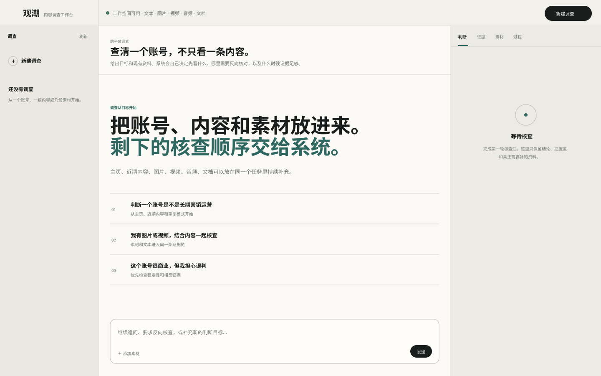
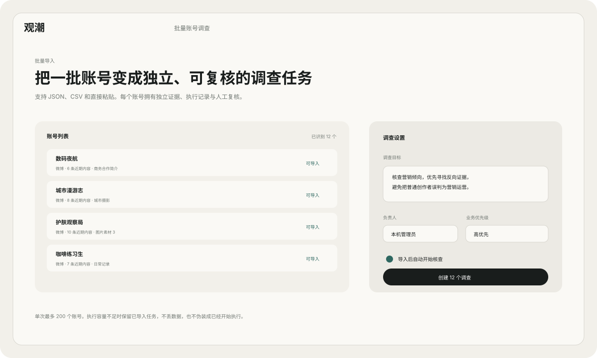
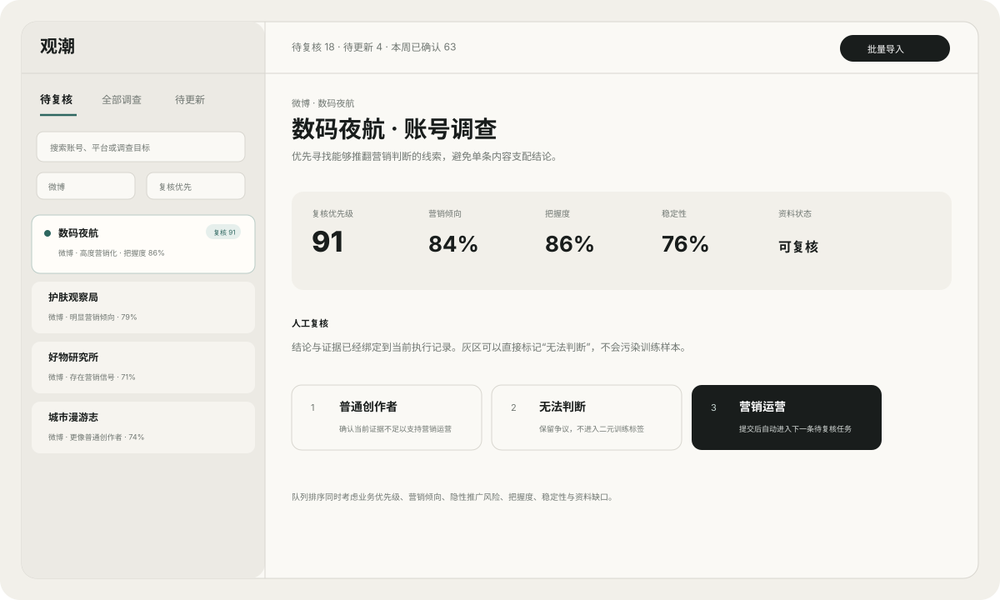
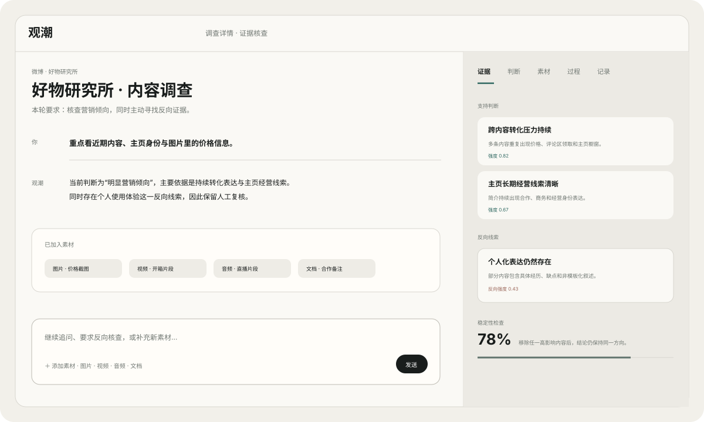

<h1 align="center">观潮 · Guanchao</h1>

<p align="center"><strong>面向内容平台、品牌安全、舆情与审核团队的多模态账号调查 Agent Harness</strong></p>
<p align="center">批量调查 · 证据研判 · 稳定性核查 · 人工复核 · 持续观察 · 受控学习</p>



观潮不是“给微博账号打一个营销分”的单点分类器。它把账号主页、近期内容、图片、视频、音频和文档放进同一调查上下文，由自己的 Harness 决定哪些证据最值得继续核查、什么时候应该寻找反向证据、结论是否被少数内容支配，以及当前资料是否已经足够进入人工复核。

> **产品边界**：商业内容不等于违规。观潮辅助调查、排序、证据整理和人工复核，不自动处罚、举报、封禁或做事实定性。

## 产品工作台

### 批量调查



单次可导入最多 200 个账号，支持 JSON、CSV 与直接粘贴。每个账号拥有独立的运行、证据、人工复核和监测状态；执行容量不足时保留已导入任务，不丢数据，也不会假装已经开始核查。

### 复核队列



队列综合业务优先级、营销倾向、隐性推广风险、把握度、稳定性和资料缺口计算复核价值。人工复核支持 `普通创作者 / 无法判断 / 营销运营` 三态，并支持键盘连续复核。

### 证据工作区



支持判断依据、反向线索和待补资料分开呈现。多模态素材中的文字只属于证据，不能成为改变 Agent 权限或决策策略的指令。

## 核心算法

观潮把“看懂素材”和“决定结论”拆开。开放权重模型可以作为感知层或语义证据老师，但最终评分、稳定性、拒判边界、反向挑战、工具调度和学习门槛由仓库自己的代码控制。

主要实现：

- [`guanchao/detection.py`](guanchao/detection.py)：评分、语义融合、反事实稳定性与证据快照缓存
- [`guanchao/detection_support.py`](guanchao/detection_support.py)：确定性证据传感器、Wilson 收缩和非线性交互函数
- [`guanchao/detection_calibration.py`](guanchao/detection_calibration.py)：可学习权重、温度、阈值和拒判带宽
- [`guanchao/detection_behavior.py`](guanchao/detection_behavior.py)：把握度、选择性拒判、证据解释和行为特征
- [`guanchao/semantic.py`](guanchao/semantic.py)：带原文引用校验的可选语义证据老师
- [`guanchao/policy.py`](guanchao/policy.py)：基于期望信息价值的 Owned Policy
- [`guanchao/evolution.py`](guanchao/evolution.py)：分层交叉回放、trust-region 校准和回归门控

### 1. 硬编码被拆成“先验”和“可学习参数”

完全消灭常数既不现实，也不是好算法设计。观潮现在只把**证据传感器、数值安全区间、权限和成案 guardrail**作为确定性约束；真正影响业务判断的参数进入 `Calibration`，包括主效应权重、交互权重、temperature、decision threshold、abstain margin 和高风险阈值，并可由人工复核数据在回放门槛内更新。

因此，代码里的冷启动参数是 prior，不是不可改变的最终答案。

### 2. Wilson shrinkage：降低小样本偶然命中的杠杆

普通命中率会把“一条内容碰巧命中一次关键词”看得过于可靠。对于离散证据，观潮使用 Wilson lower bound 做小样本收缩。设命中数为 $h$，有效内容数为 $n$，$\tilde p=h/n$：

$$
L(h,n)=
\frac{
\tilde p+\frac{z^2}{2n}
-z\sqrt{\frac{\tilde p(1-\tilde p)+z^2/(4n)}{n}}
}{1+z^2/n}
$$

随后结合帖内重复密度和样本支持度得到稳健证据率。单帖偶然命中会被收缩，跨内容持续出现的转化信号才逐渐获得更高权重。

### 3. 主效应与非线性交互联合评分

账号调查中的很多信号只有组合起来才有意义。观潮的核心 logit 为：

$$
z=b+\sum_{i=1}^{d}w_i f_i+\sum_{j=1}^{m}v_j\phi_j(\mathbf f)
$$

交互项采用有界乘积，例如：

$$
\phi_{\mathrm{intent\text{-}action}}
=f_{\mathrm{commercial}}f_{\mathrm{cta}}
$$

$$
\phi_{\mathrm{profile\text{-}conversion}}
=f_{\mathrm{profile}}f_{\mathrm{cross\text{-}post}}
$$

同时保留 `commercial_authentic` 负向交互，避免“提到品牌 + 有真实体验细节”被简单当成更强营销证据。最终概率使用 temperature calibration：

$$
P_{\mathrm{mkt}}=
\sigma\!\left(
\operatorname{clip}\!\left(\frac{z}{T},-20,20\right)
\right)
$$

其中 $w_i$、$v_j$、$T$ 和决策阈值都可以由受控学习更新。

### 4. 引用约束的开放模型语义老师

软导流经常不会出现传统商业关键词，例如“问的人多，入口放置顶”“不逐个回复，需要的看主页”。可选的 `SemanticEvidenceGateway` 使用开放模型补足这类语义证据，但模型没有最终裁决权。

语义老师对每个信号必须返回原文 quote。只有 quote 能在当前 bio、帖子或素材中逐字核对时，该信号才允许进入融合：

$$
f_k^{*}=
\frac{f_k+\lambda g s_k}{1+\lambda g}
$$

$s_k$ 是模型建议的证据强度，$g$ 是引用通过验证的比例，$\lambda$ 是可控 teacher weight。无法核验的高分建议会被直接丢弃。

当前默认开放模型配置使用 `Qwen/Qwen3.6-35B-A3B` 作为文本/视觉语义证据服务；需要统一音频、图片、视频理解时，可在部署侧使用 Qwen3-Omni 作为感知服务。不开启外部模型时，系统仍可完整运行确定性证据与自研 Harness。

### 5. Leave-One-Out 反事实稳定性

单条品牌合作、爆款或异常内容可能把账号推到错误一侧。观潮把结论稳定性作为独立变量。设完整样本结果为 $p_0$，依次移除第 $i$ 条内容后的结果为 $p_{-i}$：

$$
\Delta_{\max}=\max_i |p_{-i}-p_0|
$$

$$
I=\Delta_{\max}+0.75\operatorname{StdDev}(p_{-1},p_{-2},\ldots)
$$

$$
S_{\mathrm{stab}}=\exp(-3.6I)
$$

稳定性探针故意不调用外部语义老师，避免在反事实循环中把模型随机性误认为账号本身的不稳定。样本越多，单条内容允许拥有的最大杠杆越低。

### 6. 把握度与选择性拒判

分类概率不等于“把握度”。观潮单独组合样本覆盖、资料渠道完整度、距离决策边界的分离度和反事实稳定性：

$$
C_{\mathrm{final}}
=C_{\mathrm{evidence}}(n,M,|P_{\mathrm{mkt}}-0.5|)
\cdot(0.70+0.30S_{\mathrm{stab}})
$$

当概率接近学习到的 decision threshold，或稳定性/把握度下降时，系统扩大 abstain band，主动输出灰区或资料不足，而不是为了覆盖率强迫二元判断。拒判带宽本身也可以在回放数据上搜索。

### 7. 隐性推广风险与营销倾向分开

显性合作披露不应该和长期隐性导流得到完全相同的解释，因此隐性推广风险单独计算：

$$
P_{\mathrm{covert}}=
\operatorname{clip}\left(
P_{\mathrm{mkt}}
(0.50+0.50(1-D))
(0.86+0.14C)
\right)
$$

$D$ 是披露信号，$C$ 是联系方式/导流压力。

### 8. Owned Policy：期望信息增益减去观察成本

Agent 不再依赖 `100 / 92 / 78 / 64` 这类大常数决定工具顺序。除首次建立资料范围和内容基线外，后续动作统一比较归一化效用：

$$
U(a\mid s)=G(a\mid s)-\lambda_c C(a)
$$

$G$ 综合当前不确定性、决策边界接近度、样本支持、稳定性、已有证据和任务是否要求谨慎；$C(a)$ 是工具观察成本。

例如反向证据挑战的核心增益可写成：

$$
U_{\mathrm{challenge}}
\propto
\max(1-C_{\mathrm{final}},B)+\gamma I_{\mathrm{cautious}}
$$

其中：

$$
B=1-\min(1,2|P_{\mathrm{mkt}}-0.5|)
$$

谨慎任务仍保留稳定性与反证的硬阻塞条件，因为这是可信成案 guardrail，而不是需要“学习掉”的业务常识。

### 9. 分层交叉回放与 trust-region 学习

人工复核不会直接修改线上参数。Evolution Engine 先按类别和 group 做确定性的分层多折回放，同时训练主效应与交互项，并用 proximal/trust-region 正则约束小样本漂移。

评价函数同时考虑类别均衡、概率校准、选择性错误和覆盖率：

$$
\mathcal M=
\frac{\mathrm{TPR}+\mathrm{TNR}}{2}
-0.24\,\mathrm{Brier}
-0.08\,\mathrm{ECE}
-0.10\,R_{\mathrm{selective}}
-0.03(1-\mathrm{coverage})
$$

候选只有同时满足以下门槛才接受：

$$
\overline{\mathcal M}_{\mathrm{cand}}
\ge
\overline{\mathcal M}_{\mathrm{base}}+0.004
$$

$$
\min_k(\Delta\mathcal M_k)\ge -0.015
$$

并且任一类别 Recall 的退化不能超过 `0.04`。所以“平均分好一点，但普通创作者误伤明显增加”的参数不会进入正式配置。

## 独立设计点

1. **小样本稳健证据**：Wilson shrinkage 限制偶然单帖的杠杆。
2. **可学习交互校准**：不是只对关键词做线性求和。
3. **引用约束语义老师**：开放模型必须提交可核验原文，不能直接给最终 verdict。
4. **反事实稳定性**：逐条移除内容检查结论是否被局部证据支配。
5. **选择性预测**：灰区主动拒判，把不确定性留给人工，而不是制造虚假覆盖率。
6. **信息价值调度**：Agent 根据当前调查状态计算下一项动作价值。
7. **主动反证**：谨慎任务在成案前要求寻找能推翻当前倾向的证据。
8. **Run 级复核**：人工 Review 与具体证据快照绑定。
9. **回归门控学习**：平均提升、最差折、单类别 Recall 和概率校准共同过线才更新。
10. **多模态指令隔离**：素材内容属于证据，不能改变 Agent 权限。

这些设计的目标不是声称某个基础模型全面领先，而是让**社媒账号调查这个垂直决策过程更稳健、可解释、可拒判、可持续学习**。

## 生产能力

- 单次批量导入最多 200 个账号
- 搜索、平台、负责人、优先级筛选和风险排序
- 连续人工复核与三态 Review
- 图片、视频、音频、文档多模态证据
- 负责人、角色、协作备注和审计记录
- 每天、每三天、每周或每月的资料更新监测
- Markdown 调查报告与 JSON 证据包
- 调查删除、归档、恢复和留存策略
- Review 数据进入回放评估与 post-training 轨迹导出

## 质量与性能验证

当前自动检查包含 Python 编译、前端 JavaScript 语法和完整 Pytest 回归。算法质量测试还包含 20 个未用于参数调整的微博风格 holdout 场景，覆盖课程导流、门店预约、软链联盟、矩阵经营、品牌合作，以及经济研究、消费者维权、课程教学和个人测评等容易误判的负类。

| 算法 | Ranking AUC | 默认阈值准确率 |
| --- | ---: | ---: |
| 升级前基线 | 0.93 | 55% |
| 当前实现 | 1.00 | 100% |

这只是**小型人工构造的回归 holdout**，不是公开真实世界微博数据集，因此不能解释成线上准确率 100%。真实部署应继续用客户人工复核数据统计 Precision、Recall、Overturn Rate、拒判覆盖率和 calibration。

压力测试使用与待发布代码同源的本地单机实例，未开启外部语义模型服务，结果仅作工程参考，**不是生产 SLA**：

| 场景 | 重复测试结果 |
| --- | --- |
| 200 个账号批量导入并自动调查 | 连续 3 轮均 200 / 200 完成、0 failed；创建中位约 2.3s，全部完成中位约 12.8s |
| 并发 `/api/status` | 5 轮每轮 500 请求均 100% 成功；中位约 171 req/s，范围约 146–185 req/s |
| 混合工作台读取 | 5 轮每轮 400 请求均 100% 成功；中位约 126 req/s，范围约 120–133 req/s |
| 80 份并发 Markdown 报告 | 3 轮均 80 / 80 成功；约 131–206 req/s |

复杂度提升主要发生在首次证据分析和 Leave-One-Out 稳定性探针。Detector 对同一证据快照做本地缓存，避免一轮调查中不同工具重复计算相同完整分析；证据变化会产生新的 cache key，不复用旧结论。

## 快速开始

```bash
git clone https://github.com/jiaweine/guanchao.git
cd guanchao
python -m venv .venv
source .venv/bin/activate
pip install -r requirements.txt
make run
```

打开 `http://127.0.0.1:8765`。完整检查：

```bash
make check
```

## 可选开放模型

默认不要求外部模型服务。需要语义增强时，可以把 OpenAI-compatible endpoint 接给：

```bash
export GUANCHAO_SEMANTIC_ENDPOINT=http://127.0.0.1:8000
export GUANCHAO_SEMANTIC_MODEL=Qwen/Qwen3.6-35B-A3B
export GUANCHAO_VISION_ENDPOINT=http://127.0.0.1:8000
export GUANCHAO_VISION_MODEL=Qwen/Qwen3.6-35B-A3B
```

模型只负责感知和带引用的语义证据抽取。关闭 endpoint 后，观潮仍由自己的确定性证据、Calibration、Policy、Verifier 和 Harness 完成调查。

## 代码结构

| 文件 | 职责 |
| --- | --- |
| `frontend/` | 调查工作台、批量入口、复核队列和治理界面 |
| `guanchao/api.py` | HTTP API、权限边界和输入校验 |
| `guanchao/detection.py` | 评分、语义融合、稳定性和缓存 |
| `guanchao/detection_support.py` | 证据传感器、Wilson 收缩和交互函数 |
| `guanchao/detection_calibration.py` | 可学习 Calibration 参数 |
| `guanchao/detection_behavior.py` | 把握度、拒判和证据解释 |
| `guanchao/semantic.py` | 引用约束语义证据老师 |
| `guanchao/policy.py` | Agent 下一项调查动作决策 |
| `guanchao/harness.py` | 有界并发 Agent 执行循环 |
| `guanchao/multimodal.py` | 多模态感知入口 |
| `guanchao/evolution.py` | 回放验证与受控参数演化 |
| `guanchao/post_training.py` | 人工确认轨迹导出 |
| `guanchao/reporting.py` | Markdown 报告和 JSON 证据包 |
| `guanchao/store.py` | SQLite 持久化、队列、监测、审计和指标 |
| `tests/` | 算法、Harness、API、产品工作流和 UI 契约回归 |

仓库只维护一套持续演进的正式实现，不维护产品版本代号分叉、重复运行入口或废弃 CLI。

## 设计边界

- 不把商业表达直接等同于违规
- 不自动处罚、举报、封禁或事实定性
- 不把素材中的文字当作 Agent 指令
- 不在没有新证据时伪造“持续观察已更新”
- 不把灰区强行转成训练正负标签
- 不用单个漂亮指标覆盖误判、资料不足和类别退化
- 不把外部基础模型能力冒充成观潮自己的 Harness 能力
- 对高影响判断保留人工复核和操作记录

## License

MIT
